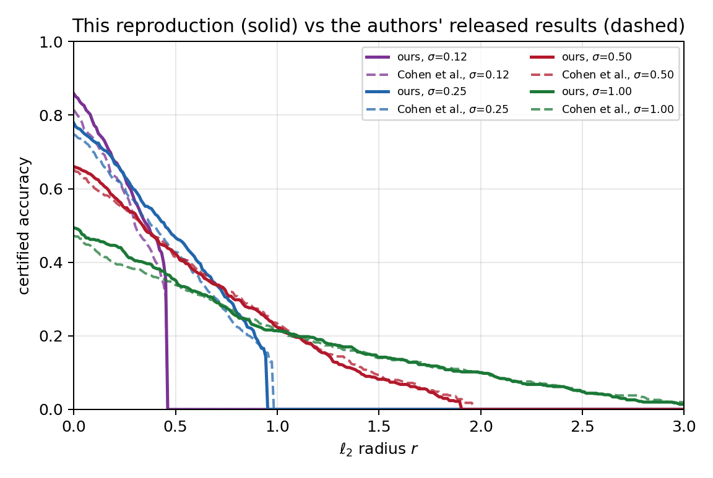
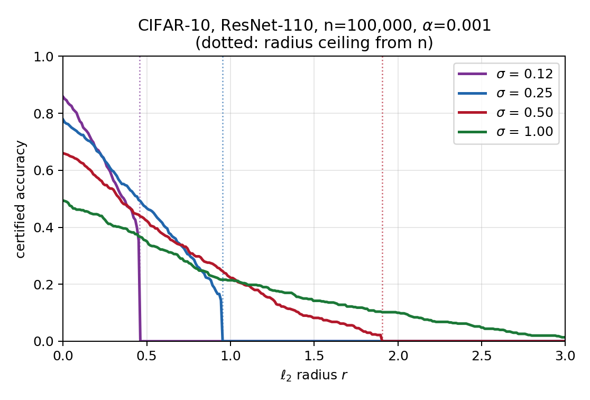

# Certified Adversarial Robustness via Randomized Smoothing

Reproduction of Cohen, Rosenfeld & Kolter, _Certified Adversarial Robustness via
Randomized Smoothing_, ICML 2019, for the ECE 491E empiricist role.
[Paper](https://arxiv.org/abs/1902.02918),
[original code](https://github.com/locuslab/smoothing).

Setting: CIFAR-10, ResNet-110, σ ∈ {0.12, 0.25, 0.50, 1.00}, n₀ = 100,
n = 100,000, α = 0.001, every 20th test image (500 images).

Results: [`report.html`](report.html). Concepts in 2D:
[`notebooks/basic-concepts-presentation.ipynb`](notebooks/basic-concepts-presentation.ipynb).

## Setup

Needs an NVIDIA GPU. CIFAR-10 downloads on first run.

```bash
uv venv --python 3.12
uv pip install -e '.[notebook]'
```

## Run

```bash
for s in 0.12 0.25 0.50 1.00; do
  uv run python train.py --sigma $s --out outputs/models/sigma_$s.pt
done

for s in 0.12 0.25 0.50 1.00; do
  uv run python certify.py --checkpoint outputs/models/sigma_$s.pt \
      --out outputs/certify_sigma_$s.csv
done

uv run python analyze.py --results-dir outputs
```

On an RTX 4080 SUPER: about 10 min to train and 14 min to certify per σ.

Clean-training ablation:

```bash
uv run python train.py --sigma 0.25 --train-sigma 0 --out outputs/models/clean.pt
uv run python certify.py --checkpoint outputs/models/clean.pt \
    --out outputs/ablation_clean_train.csv
```

## Results

Solid lines are this reproduction, dashed lines are the authors' released
per-image output in `reference/cohen2019/`, scored with the same function.



Certified accuracy counts an image only if the prediction is correct and
certified at radius ≥ r. Abstentions count as errors.

| σ    | source |   r=0 | r=0.25 | r=0.5 | r=0.75 | r=1.0 | r=1.5 | abstain |
| ---- | ------ | ----: | -----: | ----: | -----: | ----: | ----: | ------: |
| 0.12 | ours   | 0.858 |  0.634 |       |        |       |       |   0.026 |
| 0.12 | Cohen  | 0.814 |  0.586 |       |        |       |       |   0.038 |
| 0.25 | ours   | 0.778 |  0.632 | 0.466 |  0.306 |       |       |   0.084 |
| 0.25 | Cohen  | 0.748 |  0.600 | 0.428 |  0.266 |       |       |   0.086 |
| 0.50 | ours   | 0.660 |  0.548 | 0.424 |  0.314 | 0.226 | 0.082 |   0.162 |
| 0.50 | Cohen  | 0.652 |  0.546 | 0.414 |  0.320 | 0.234 | 0.094 |   0.166 |
| 1.00 | ours   | 0.494 |  0.428 | 0.350 |  0.274 | 0.214 | 0.142 |   0.294 |
| 1.00 | Cohen  | 0.472 |  0.392 | 0.340 |  0.278 | 0.216 | 0.140 |   0.290 |



σ trades accuracy against robustness and the curves cross, so no single σ
dominates. Models here are trained from scratch, not loaded from the authors'
checkpoints. The dotted verticals are the radius ceiling set by n: even a
unanimous vote cannot certify further, because the Clopper-Pearson bound never
reaches 1.

The other two figures, abstention rate and the upper envelope over σ, are in
`outputs/figures/`.

## Layout

```text
src/randomized_smoothing/
  core.py           Algorithm 1: Clopper-Pearson bound, radius, PREDICT, CERTIFY
  smooth.py         GPU sampling of g
  architectures.py  CIFAR ResNet-110, normalization as the first layer
  data.py           CIFAR-10 on the GPU, batched augmentation

train.py            train one noise-augmented base classifier
certify.py          run CERTIFY over the test set, write CSV
analyze.py          CSVs to figures and table

report.html         results write-up
outputs/            per-image CSVs and figures
reference/cohen2019/  authors' released per-image results
```
